# Báo Cáo Bug

## Thông tin sinh viên 
- MSSV: 23127364
- Họ tên: Đặng Nguyễn Thành Hiếu
- Lớp: 23KTPM04

## FR-03 - Quên Mật Khẩu Và Đặt Lại Mật Khẩu

| Bug ID | Test case đại diện | Mức độ | Bằng chứng | Tóm tắt |
|---|---|---|---|---|
| BUG-FR03-001 | FR03-DT-01 | High | 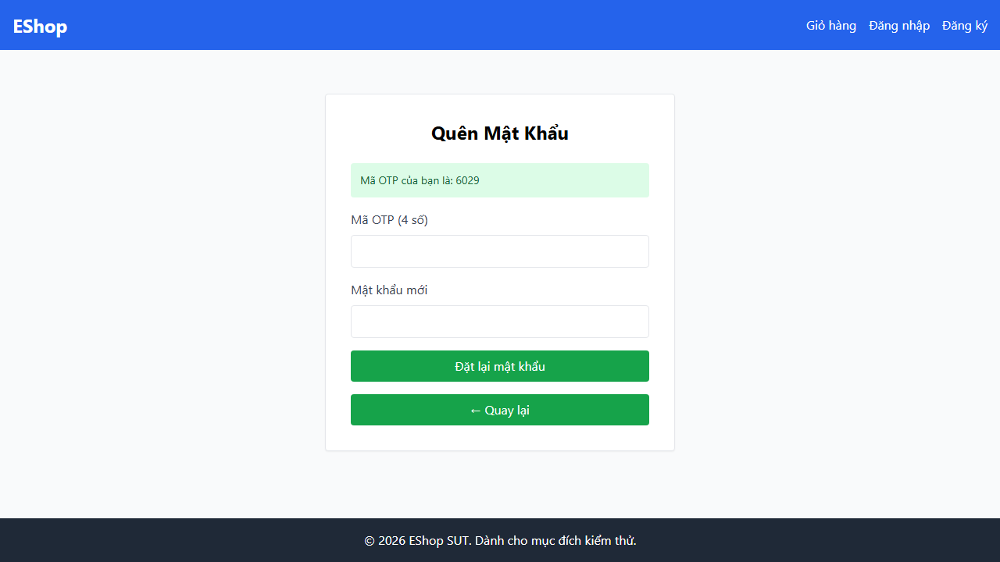 | OTP được hiển thị trực tiếp trên UI sau khi yêu cầu quên mật khẩu, vi phạm yêu cầu bảo mật. |
| BUG-FR03-002 | FR03-DT-02 | Medium | 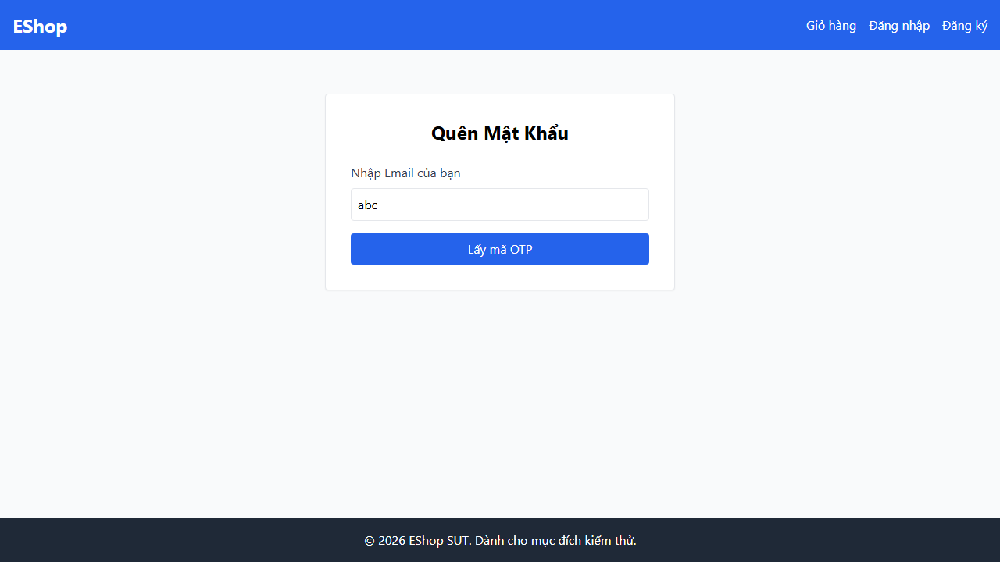 | Email sai định dạng `abc` bị xử lý như `User not found` thay vì lỗi format email. |
| BUG-FR03-003 | FR03-DT-05 | Medium | 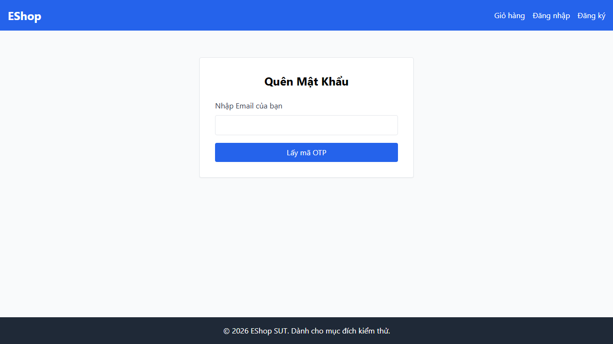 | Email toàn khoảng trắng không được trim/validate như giá trị rỗng. |
| BUG-FR03-004 | FR03-DT-07, FR03-DT-08 | High | 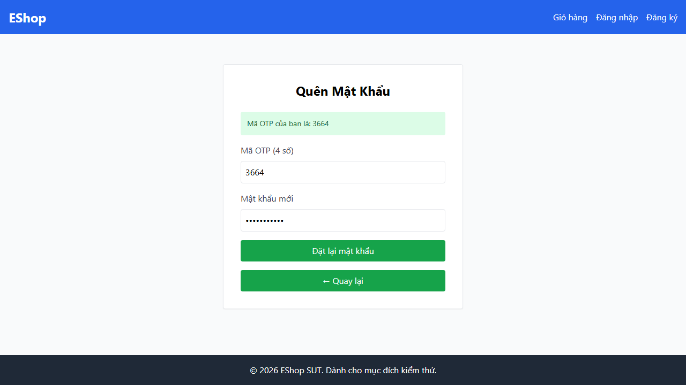 | Password hợp lệ như `NewPass123!` bị báo yếu; lỗi password cũng che mất các lỗi OTP không hợp lệ. |

## FR-09 - Mã Giảm Giá

| Bug ID | Test case đại diện | Mức độ | Bằng chứng | Tóm tắt |
|---|---|---|---|---|
| BUG-FR09-001 | FR09-DT-01 | High | 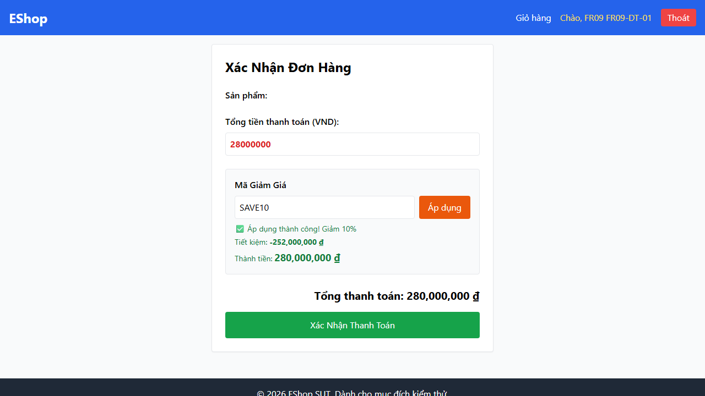 | `SAVE10` phải giảm 10% cho đơn `28,000,000`, nhưng UI hiển thị tiết kiệm `-252,000,000` và thành tiền `280,000,000`. |
| BUG-FR09-003 | FR09-DT-07 | High |  | Coupon fixed discount `NEW10` có thể làm tổng tiền sau giảm bị âm; automation quan sát được `-72,000,000`. |
| BUG-FR09-002 | FR09-BVA-02 | Medium | 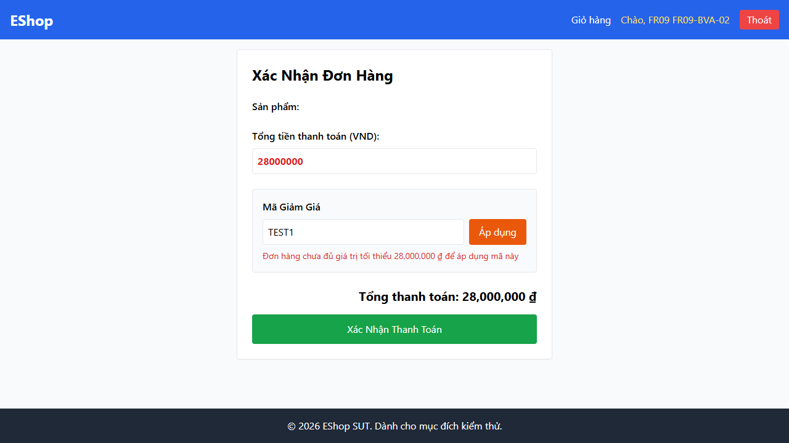 | Coupon `TEST1` tại đúng biên `28,000,000` bị reject thay vì được áp dụng. |

## FR-15 - Quản Lý Sản Phẩm CRUD

| Bug ID | Test case đại diện | Mức độ | Bằng chứng | Tóm tắt |
|---|---|---|---|---|
| BUG-FR15-005 | FR15-DT-03 | High | 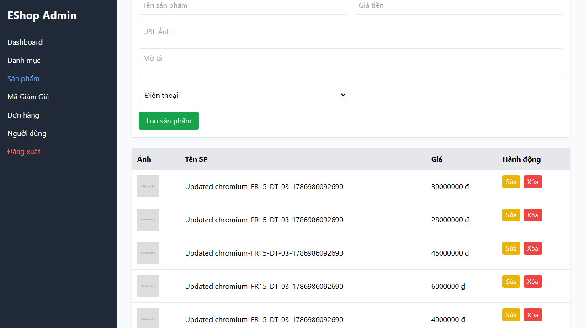 | Cập nhật một sản phẩm làm nhiều dòng trong UI đổi thành cùng thông tin cập nhật. |
| BUG-FR15-002 | FR15-DT-05 | High | 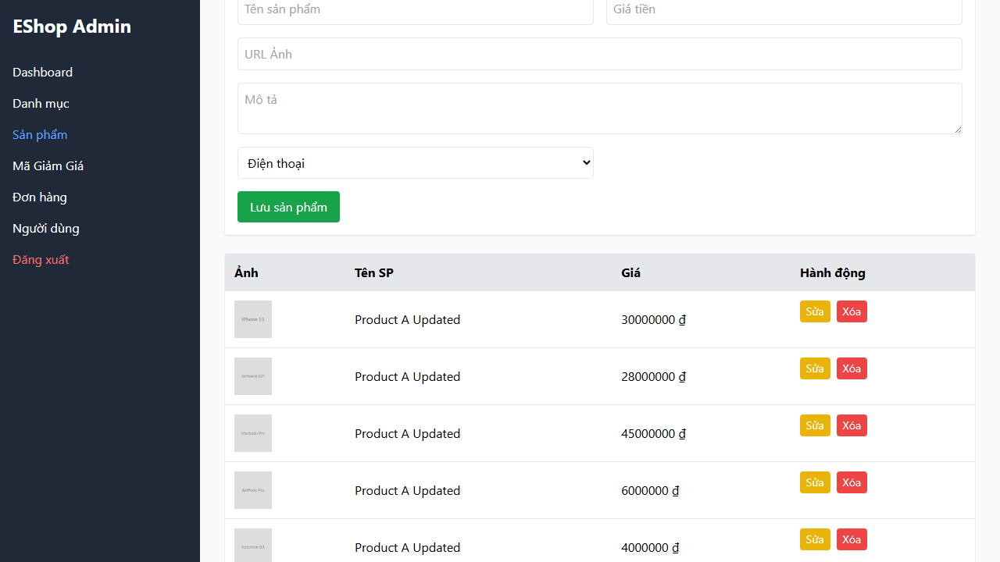 | Giá rỗng khi cập nhật hoặc tạo sản phẩm vẫn được chấp nhận, dữ liệu gốc bị thay đổi hoặc sản phẩm lỗi được tạo. |
| BUG-FR15-001 | FR15-DT-08 | Medium |  | Tên sản phẩm chỉ gồm khoảng trắng vẫn được tạo thành công. |
| BUG-FR15-004 | FR15-DT-13 | Medium | 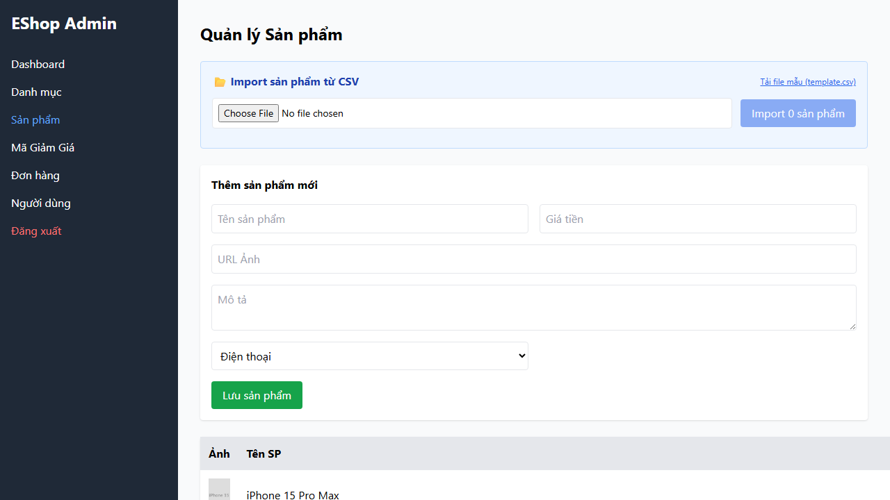 | Tên sản phẩm dài hơn 255 ký tự vẫn được chấp nhận. |
| BUG-FR15-003 | FR15-DT-15, FR15-BVA-07 | High | 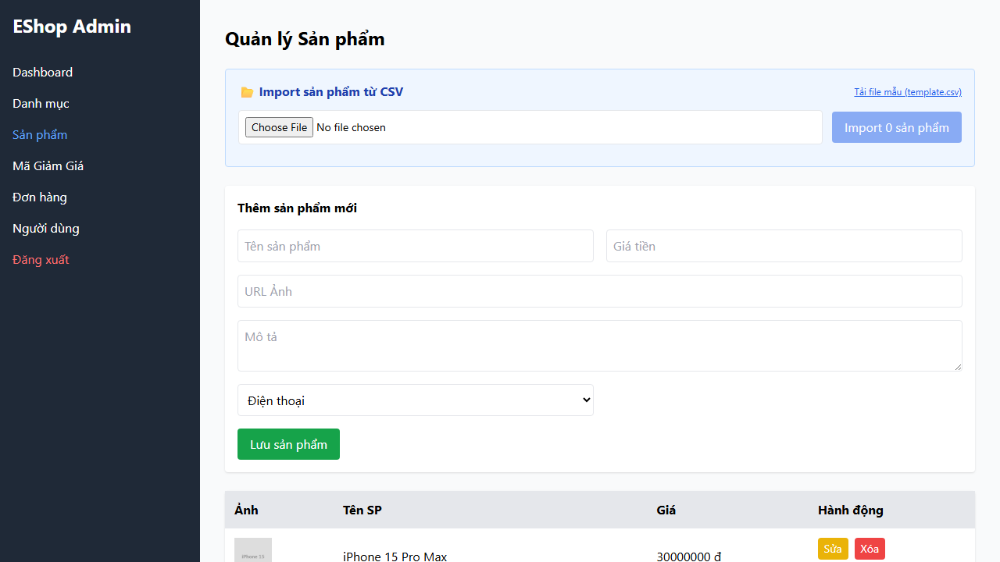 | Giá âm hoặc bằng `0` vẫn được chấp nhận khi tạo/cập nhật sản phẩm. |

## GitHub Issue Links

| Bug ID | GitHub Issue |
|---|---|
| BUG-FR03-001 | [1](https://github.com/SieuNhanGao889/hcmus_automation_assignment/issues/1) |
| BUG-FR03-002 | [2](https://github.com/SieuNhanGao889/hcmus_automation_assignment/issues/2) |
| BUG-FR03-003 | [3](https://github.com/SieuNhanGao889/hcmus_automation_assignment/issues/3) |
| BUG-FR03-004 | [4](https://github.com/SieuNhanGao889/hcmus_automation_assignment/issues/4) |
| BUG-FR09-001 | [5](https://github.com/SieuNhanGao889/hcmus_automation_assignment/issues/5) |
| BUG-FR09-002 | [6](https://github.com/SieuNhanGao889/hcmus_automation_assignment/issues/6) |
| BUG-FR09-003 | [7](https://github.com/SieuNhanGao889/hcmus_automation_assignment/issues/7) |
| BUG-FR15-001 | [8](https://github.com/SieuNhanGao889/hcmus_automation_assignment/issues/8) |
| BUG-FR15-002 | [9](https://github.com/SieuNhanGao889/hcmus_automation_assignment/issues/9) |
| BUG-FR15-003 | [10](https://github.com/SieuNhanGao889/hcmus_automation_assignment/issues/10) |
| BUG-FR15-004 | [11](https://github.com/SieuNhanGao889/hcmus_automation_assignment/issues/11) |
| BUG-FR15-005 | [12](https://github.com/SieuNhanGao889/hcmus_automation_assignment/issues/12) |

- Github Issue ảnh minh họa: 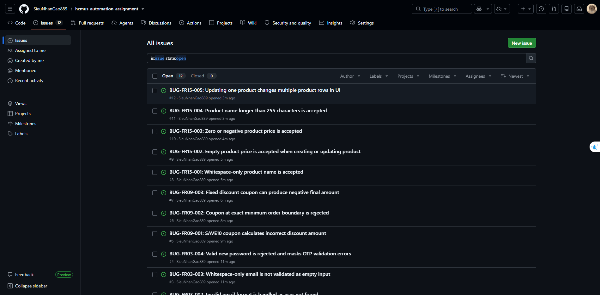